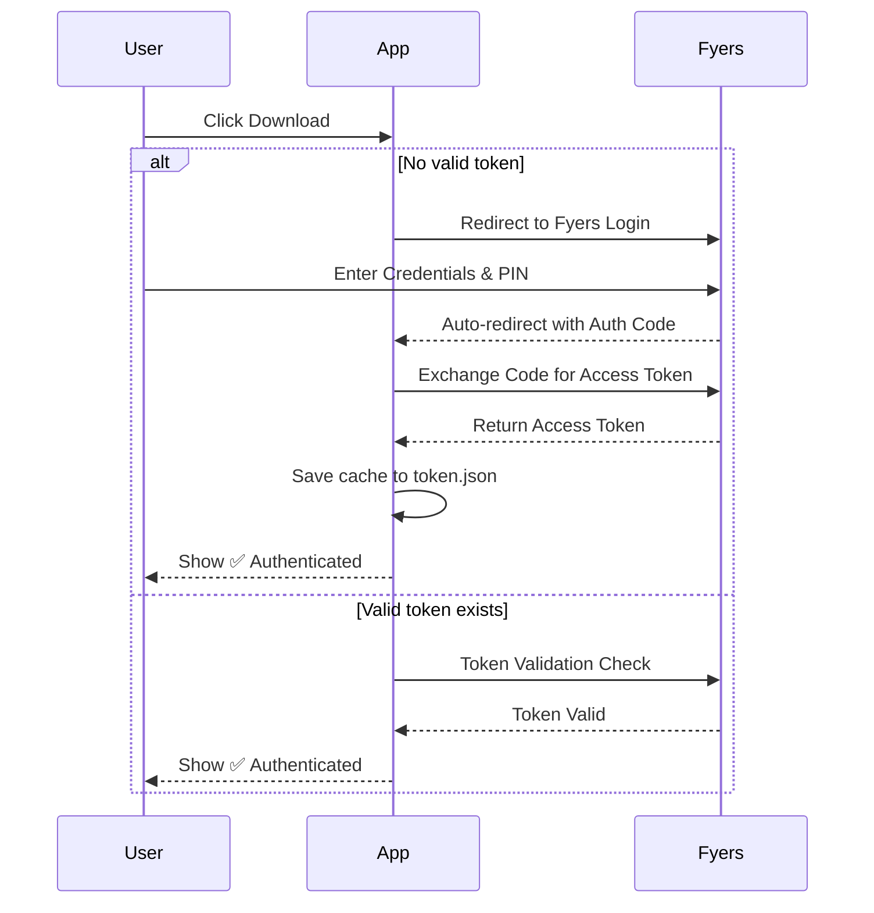

# Fyers MCX Data Extractor

A beautiful, production-grade tool designed to download historical MCX futures OHLCV data directly from the Fyers API v3. 

It features both a robust **Command Line Interface (CLI)** and a gorgeous **Web UI** built with FastAPI and Vanilla JS.


---

## 🛠️ Built With / Tech Stack

- **[Python](https://www.python.org/)**: Core backend logic for async scheduling and chunking.
- **[FastAPI](https://fastapi.tiangolo.com/)**: High-performance asynchronous web framework powering the UI.
- **Vanilla JS**: Clean, dependency-free frontend with Glassmorphism styling.
- **[Fyers API v3](https://myapi.fyers.in/)**: Official broker API for historical data extraction.

---

## ✨ Features

- **Beautiful Web Interface**: A modern, interactive web portal that makes downloading data as simple as point-and-click.
- **Smart Symbol Auto-Discovery**: Automatically parses the live Fyers MCX Master CSV to search, dropdown, or auto-detect active continuous future contracts (e.g., `MCX:CRUDEOIL26MARFUT`).
- **Data Chunking**: Automatically bypasses Fyers' 100-day limit per request by securely chunking dates behind the scenes.
- **Robust Retries**: Handles API rate-limiting and connection failures gracefully using exponential backoff.
- **Smart Auth Flow**: Opens the browser for OAuth only when required. Caches valid tokens locally in `token.json` so you stay logged in.

---

## 🚀 Setup Instructions

### 1. Prerequisites
- Python 3.9+
- A [Fyers Developer Account](https://myapi.fyers.in/) and a live trading account.

### 2. Create a Fyers API App
1. Go to the [Fyers API Dashboard](https://myapi.fyers.in/).
2. Create a new App.
3. Set the **Redirect URI** to `http://127.0.0.1:8000/api/auth/callback`.
4. After creation, copy your **App ID** (Client ID) and **Secret Key**.

### 3. Installation
1. Clone this repository:
   ```bash
   git clone https://github.com/Achal13jain/Fyers-data-extractor.git
   cd Fyers-data-extractor/fyers_mcx_downloader
   ```
2. Create and activate a virtual environment:
   ```bash
   python -m venv venv
   # On Windows:
   venv\Scripts\activate
   # On Mac/Linux:
   source venv/bin/activate
   ```
3. Install the dependencies:
   ```bash
   pip install -r requirements.txt
   ```

### 4. Configuration
1. Rename `.env.example` to `.env`:
   ```bash
   cp .env.example .env
   ```
2. Open `.env` and fill in your credentials from Step 2:
   ```env
   FYERS_CLIENT_ID=your_client_id_here
   FYERS_SECRET_KEY=your_secret_key_here
   FYERS_REDIRECT_URI=http://127.0.0.1:8000/api/auth/callback
   LOG_LEVEL=INFO
   ```

---

## 🔐 Authentication (Fully Automatic)

Authentication is handled entirely through the browser — **no terminal interaction required**.



1. **Click Download** on the Web UI. If no valid token exists, you'll be redirected to the Fyers login page.
2. **Log in** with your Fyers credentials (Client ID + 4-digit PIN).
3. **Auto-redirect**: After login, Fyers redirects back to the app which automatically captures your auth code, generates a token, and saves it.
4. **Done!** You'll see a green "✅ Authenticated" badge. Click Download again to get your CSV.

*The token is cached in `token.json` and reused until it expires (end of day). Future downloads are instant.*

---

## 💻 Web App Usage (Recommended)

The easiest way to extract data is using the interactive local web server.

1. Run the FastAPI server:
   ```bash
   python web.py
   ```
2. Open your browser to `http://127.0.0.1:8000`.
3. Type in any symbol like `SILVER` or `CRUDEOIL` to search the active futures contracts dynamically.
4. Select your desired **Resolution/Timeframe** (e.g., 1 Minute, 5 Minutes, Daily).
5. Select your date ranges and click Download! The CSV will immediately compile and save to your computer.

### Sample Output (`gold_1min.csv`)
```csv
timestamp,open,high,low,close,volume
2024-01-01 09:00:00,63240,63245,63210,63230,1250
2024-01-01 09:01:00,63230,63255,63225,63248,850
2024-01-01 09:02:00,63248,63260,63240,63252,900
```

---

## ⌨️ CLI Usage

If you prefer terminal commands for automation, the CLI is fully supported. 
*Note: On your very first run, it will open your browser to log into Fyers and generate the OAuth token. Read the console logs for instructions.*

**Download 1-min data for the default Gold symbol from Jan 2024 to today:**
```bash
python main.py --from 2024-01-01
```

**Download with a custom symbol and output file:**
```bash
python main.py --symbol MCX:GOLD25JUNFUT --from 2024-06-01 --to 2024-09-30 --output gold_jun2024.csv
```

**Supported Resolutions:**
`1`, `2`, `3`, `5`, `10`, `15`, `20`, `30`, `60`, `120`, `240`, `1D`

---

## ❓ Troubleshooting / FAQ

- **"Invalid Redirect URI" Error**: Make sure you've exactly matched `http://127.0.0.1:8000/api/auth/callback` in your Fyers App Redirect URI settings.
- **Token Expiry**: The token cached in `token.json` lasts until the end of the day. If it expires, the app will seamlessly prompt you to log in again.
- **Rate Limit Errors**: Fyers has strict limits on historical API calls. The script uses exponential backoff and chunking to manage it, but if you hit extreme limits, wait a minute for limits to reset before retrying.

---

## 🤝 Contributing

Contributions are what make the open-source community such an amazing place to learn, inspire, and create. Any contributions you make are **greatly appreciated**. 

Please see the [CONTRIBUTING.md](CONTRIBUTING.md) file for more information.

## 📝 License

Distributed under the MIT License. See `LICENSE` for more information.
